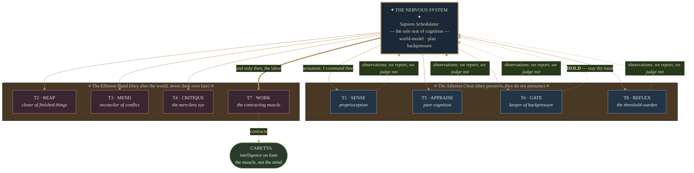
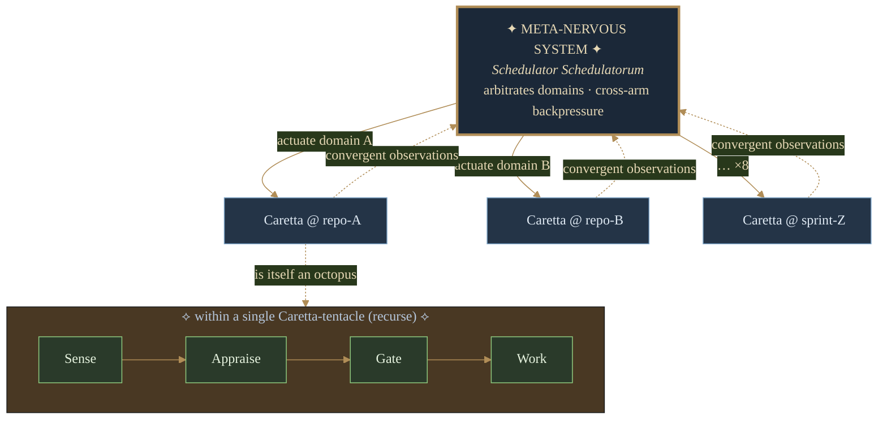

# Octopus Prime — A Theory

> *"The arms do not know they are obeying. That is what makes them obedient."*

> Status: theory / design sketch. No code here is binding; this document exists
> to argue for a shape, not to specify an implementation. The unsettling part —
> see the appendices — is how much of the shape **already exists in the code**.
> The contract was not designed; it was found.

## 1. The premise

Caretta today is a single self-steering autopilot. On every invocation it reads
the repository's pulse, picks one route (`work` or `factory`), and runs it
inline. The whole organism is one arm: it observes, decides, and acts in a
single straight-line pass through `runAutopilot`
(`src/application/run-autopilot.ts`).

**Octopus Prime** asks a different question: what if the *deciding* and the
*acting* were pulled apart into two different kinds of thing?

- **Eight tentacles** — narrow, reflexive effectors. Each one does exactly one
  bounded job against the repository and nothing else.
- **One nervous system** — an intelligent scheduler that holds the world-model,
  decides which tentacle to fire and when, and sequences their work.

The design constraint the name encodes: **each tentacle is idempotent.** Firing
a tentacle twice with the same signal is indistinguishable from firing it once —
no double-closed issues, no duplicate CI dispatch, no second commit. From this
one property the rest follows: a tentacle keeps no memory between actuations,
cannot schedule itself, cannot summon another tentacle, and holds no judgment
about whether it *should* run. All intelligence lives in the nervous system;
the limbs are reflex arcs. This deliberately inverts real octopus biology
(where most neurons live in the arms): Octopus Prime centralizes cognition and
leaves the arms safely repeatable.

Why bother? Three payoffs:

1. **Testability.** An idempotent, stateless tentacle is a pure-ish function:
   signal in, observation out. No hidden scheduling, no cross-talk.
2. **Composability.** Eight small effectors recombine into behaviors the
   monolithic pass can't express (e.g. "review three PRs, then hold").
3. **Backpressure as a first-class concept.** The CI-hold logic that's
   currently tangled into the linear pass becomes the scheduler's whole job.

## 2. Mapping the metaphor onto what already exists

The good news: Caretta is *already* decomposed into the right organs. The eight
tentacles are not new capabilities — they are the concerns that
`runAutopilot` currently calls in sequence, promoted to first-class,
independently-actuated effectors. The current code does each of these as a
hardcoded step:

| Existing concern (file)                              | Becomes tentacle |
| ---------------------------------------------------- | ---------------- |
| `gh.listOpenIssues` / `listOpenPullRequests`         | T1 · **Sense**   |
| `closeIssuesForMergedPrs` (`close-on-merge.ts`)      | T2 · **Reap**    |
| `resolveDirtyAgentPRs` (`conflict-resolver.ts`)      | T3 · **Mend**    |
| `reviewAndFixAgentPRs` (`execute-autopilot.ts`)      | T4 · **Critique**|
| `domain.evaluate` / `findActiveSprint` (`evaluate.ts`)| T5 · **Appraise**|
| `processAgentPRs` (`pr-ci.ts`, `ci-dispatcher.ts`)   | T6 · **Gate**    |
| `executeAutopilot` (`work`/`factory` child actions)  | T7 · **Work**    |
| `domain.decideTrigger` (`trigger.ts`)                | T8 · **Reflex**  |

The nervous system is the elevated descendant of `AutopilotUseCase` and
`AutopilotDomainLogic` (`src/domain/autopilot-domain.ts`): the policy objects
(`TriggerPolicy`, `EvaluationPolicy`, `ExecutionDecisionPolicy`,
`SummaryPolicy`) are exactly the kind of pure decision logic that belongs in a
brain, not a limb. Octopus Prime's thesis is that those policies should *drive*
the tentacles rather than be buried in a fixed call order.

## 3. The eight tentacles

Each tentacle is defined by a job, an actuation signal, and a returned
observation. None of them decides whether it *should* run — that is always the
nervous system's call.

1. **T1 · Sense** — fetch open issues and PRs; return the raw repo state. The
   only tentacle the scheduler fires unconditionally at the start of a pass.
2. **T2 · Reap** — close issues whose PRs merged. Idempotent: closing an
   already-closed issue is a no-op observation.
3. **T3 · Mend** — resolve `DIRTY` agent PRs (merge-conflict remediation).
   Non-disruptive: never dispatches new work or others' CI.
4. **T4 · Critique** — code-review and fix agent PRs whose CI has settled.
5. **T5 · Appraise** — evaluate sprint state, pick a route, name a tracker.
   Pure computation; touches no external state.
6. **T6 · Gate** — scan agent PRs for a head-SHA `Test` check and dispatch
   `ci.yml` where missing. Produces the backpressure signal (`hold_target`).
7. **T7 · Work** — install and run caretta itself via the `work-dispatch` or
   `factory-cycle` child action. The only tentacle that creates commits.
8. **T8 · Reflex** — the self-gate. Given the triggering event, decide whether
   this whole organism should wake at all (the cheap "exit cleanly" path).

T5, T6 and T8 are *afferent* (they sense and report); T2, T3, T4, T7 are
*efferent* (they change the world); T1 is the proprioceptor. The scheduler only
fires efferent tentacles once the afferent ones have built a coherent picture.

### The idempotence contract

For a tentacle to be legitimately "idempotent" it must satisfy:

- **Idempotent** — firing twice with the same signal is indistinguishable from
  firing once; every write is safe to replay (the current `Reap`/`Gate` steps
  already aim for this). This is the load-bearing property; the rest enforce it.
- **Stateless** — no memory across actuations; all input arrives in the signal.
- **Single-shot & bounded** — one job, terminates, no internal loops over the
  repo's lifecycle.
- **No self-scheduling** — cannot enqueue itself or any sibling.
- **Structured observation out** — returns data the scheduler can reason over,
  never a fire-and-forget side effect with no report.

This is essentially the `EvaluationResult` / `PrCiResult` / `AutopilotDecision`
discipline already present in `@caretta/action-common/types`, generalized so
*every* tentacle speaks it.

## 4. Centralized vs. decentralized — and the recommendation

The user posed the open question: is the nervous system centralized or
decentralized? The honest answer is that "tentacle" and "nervous system" are
two different axes, and the right design splits them:

- **Cognition: centralized.** One scheduler owns the world-model and all
  decisions. This is what lets tentacles stay reflexive and keeps the system
  reasoning-about-able. A decentralized brain (tentacles negotiating
  peer-to-peer) reintroduces exactly the hidden cross-talk we're trying to
  delete, and on GitHub's eventually-consistent API it invites races (two arms
  dispatching CI for the same SHA).
- **Execution: decentralized.** The tentacles are physically distributed and
  ephemeral — each is a separate GitHub Action run / workflow dispatch,
  spun up on demand, with no shared process. They already work this way:
  `work-dispatch-action` and `factory-cycle-action` are independent packages
  with their own `dist/index.js`.

So: **a centralized brain commanding decentralized reflexes** — which, fittingly,
is roughly how a real octopus splits a central brain from arm-local ganglia,
just with the autonomy dial turned down to zero on the arms.

### The Cephalopod Cathedral — an architecture in eight movements

> What follows is not merely a diagram. It is a *cosmogony*: the centralized
> Logos descending into eight obedient, memoryless limbs, each a perfect
> instrument of a will that is not its own.



For the ASCII-inclined and the unpretentious:

```
                    ┌─────────────────────────────┐
                    │     NERVOUS SYSTEM           │
                    │  (intelligent scheduler)     │
                    │  • world-model of the repo   │
                    │  • policy: when/which/order  │
                    │  • backpressure & holds      │
                    └───────────────┬─────────────┘
        actuation signals           │            structured observations
        ┌──────────┬──────────┬─────┼─────┬──────────┬──────────┐
        ▼          ▼          ▼     ▼     ▼          ▼          ▼
      ┌────┐    ┌────┐    ┌────┐ ┌────┐ ┌────┐    ┌────┐    ┌────┐  ...×8
      │ T1 │    │ T2 │    │ T3 │ │ T4 │ │ T5 │    │ T6 │    │ T7 │
      └────┘    └────┘    └────┘ └────┘ └────┘    └────┘    └────┘
       each: idempotent · stateless · single-shot · no self-scheduling
```

## 5. The nervous system as an intelligent scheduler

The scheduler is the only stateful, decision-making component, and "intelligent"
means it does more than fixed sequencing. Its responsibilities:

1. **Build the world-model.** Fire T1 (Sense); fold the result into a snapshot:
   open issues, agent PRs, sprint/tracker, CI state per head SHA.
2. **Plan an actuation order.** Today the order is hardcoded in
   `runAutopilot` (sense → reap → mend → critique → appraise → gate → work).
   The scheduler makes this a *derived* plan from the snapshot + policies, so it
   can skip dead steps and reorder safe ones.
3. **Apply backpressure.** The `computeHoldTarget` / `decideExecution` logic in
   `decide.ts` is the heart of the brain: if T6 (Gate) reports in-flight CI,
   the scheduler withholds T7 (Work) this pass and reports a hold instead of
   blocking. This is already the system's smartest behavior — Octopus Prime
   makes it the scheduler's defining job rather than an `if` in a linear pass.
4. **Resolve contention.** Because cognition is centralized, only the scheduler
   can dispatch CI or run work, so two tentacles can never race on the same SHA.
5. **Be idempotent across passes.** Each invocation is a fresh tick: re-sense,
   re-plan, re-decide. Holding rather than blocking (the current model) means a
   pass always terminates, and the *next* trigger picks up where this left off.

A natural extension the decomposition unlocks: the scheduler can run a partial
plan (e.g. Mend + Critique only, deferring Work) without the all-or-nothing
shape of today's pass — useful when an event is "interesting but not yet
actionable."

## 6. Where Caretta fits

Caretta is **not** one of the eight tentacles, and it is not the nervous system.
Caretta is the *muscle* that **T7 · Work** contracts — the installed agent
(`caretta-install.ts`) the Work tentacle runs to actually author commits. The
relationship is:

- **Octopus Prime (scheduler)** decides *whether and when* to act.
- **T7 (tentacle)** is the idempotent effector that *invokes* the agent.
- **Caretta (agent)** is the intelligence-on-loan that does the open-ended
  authoring work once told to.

This keeps the idempotence contract intact: T7 itself holds no judgment; it just
runs caretta with the context the scheduler handed it. Caretta's own
intelligence is downstream of, and gated by, the scheduler — it never decides
to wake itself.

This repository — `caretta-autopilot-action` — is therefore the seed of the
nervous system plus its eight tentacles. The migration is mostly *re-drawing
boundaries* around code that already exists, not writing new behavior.

## 7. Caretta as a tentacle: the fractal reading

Section 6 places Caretta *inside* one tentacle, as the muscle T7 contracts.
There is a second, arguably truer reading — closer to the founding ask of
"eight autopilots." Caretta **is** an autopilot. So let each tentacle *be* a
whole Caretta instance, scoped to a domain (a repository, a label, a sprint),
and let the nervous system arbitrate eight of them. The octopus becomes
**fractal**: a macro-organism of Caretta-tentacles, each of which is itself a
micro-organism whose internal anatomy is the eight concerns of Section 3.



What this buys, and what it costs:

- **It honors the original wording.** Eight autopilots, eight tentacles, one
  scheduler. No reinterpretation of "tentacle" required.
- **It collides with the idempotence contract — productively.** Caretta is a
  non-deterministic agent; fire it twice and you do *not* get the same diff. A
  Caretta-tentacle therefore cannot be strictly idempotent. The honest fix is to
  **split the property by tentacle kind**:
  - *Mechanical tentacles* (Reap, Gate) remain strictly **idempotent** — replay
    is bitwise-safe.
  - *Agent-bearing tentacles* (a whole Caretta) are merely **convergent**:
    re-firing drives the domain toward a goal state rather than duplicating
    work, and the existing CI-hold + `agent/issue-*` gating already makes a
    second dispatch safe *at the boundary*, even when the interior is stochastic.
  This is a weaker claim than Section 4's, and a more honest one. You cannot
  bolt a stochastic agent onto an idempotency guarantee and call it clean; you
  can bolt it onto a *convergence* guarantee.
- **It relocates the scheduler's job.** The nervous system no longer sequences
  *concerns* — it arbitrates *domains*: which Caretta to wake, in what order,
  and (critically) backpressure **across** arms so two Carettas never touch the
  same SHA or repository at once. That cross-arm contention is the entire reason
  cognition must stay centralized in this reading.

The two readings are not rivals; they are zoom levels. Section 6 is the view at
one repository; Section 7 is the view across a fleet. The same `signal →
observation` contract holds at both — only the units (`concern` vs. `domain`)
and the strength of the safety property (`idempotent` vs. `convergent`) change.

## 8. A plausible path (not a commitment)

1. Formalize the **tentacle interface** (`signal → observation`) in
   `action-common`, generalizing the existing result types.
2. Wrap each of the eight existing concerns to satisfy the idempotence contract
   (stateless, idempotent, no self-scheduling). Most already nearly do.
3. Lift the fixed call order out of `runAutopilot` into a **scheduler** that
   derives the plan from the snapshot + the existing policy objects.
4. Keep tentacles deployable as independent action runs (decentralized
   execution), with the scheduler as the one entry point that fans out.
5. Leave Caretta exactly where it is — the muscle behind T7.

## 9. Open questions

- **Tick source.** Does the scheduler run per-event (current model) or hold a
  longer-lived loop? Per-event preserves the "hold, don't block" property.
- **Observation transport.** In-process return values, action outputs, or a
  persisted snapshot (issue comment / artifact) when tentacles are separate runs?
- **Is eight load-bearing?** The eight here are *derived* from current
  concerns. If a ninth concern appears (e.g. release-cutting), does it become a
  tentacle, or fold into an existing one? The metaphor shouldn't constrain the
  architecture.
- **Failure semantics.** When an efferent tentacle fails mid-plan, does the
  scheduler abort the tick or continue with the remaining safe tentacles?
- **Which zoom level ships first?** Section 6 (concerns within one repo) is a
  refactor of existing code; Section 7 (a fleet of Carettas) is net-new
  orchestration. Do we build the micro-octopus first and recurse outward, or
  stand up the meta-scheduler and let each arm stay a monolithic Caretta for now?

---

# Appendices — the part that should worry you

The body above is a metaphor. The appendices are the receipts. Everything below
is checkable against the source in this repository; where a claim rests on code,
the file and symbol are named so you can `git grep` it yourself.

## Appendix A — The contract, in types

A tentacle is a function from a slice of the world-model (`signal`) to a
structured observation. Nothing more.

```ts
// The shape every tentacle satisfies. S is the slice of state the scheduler
// hands down; O is the observation it hands back. No tentacle reads ambient
// state, schedules itself, or calls a sibling.
type Tentacle<S, O> = (signal: S) => Promise<O> | O;
```

Now the unsettling part. Three of the eight arms — and the scheduler's entire
decision core — **already exist as total, pure functions with exactly this
signature.** They were written as ordinary domain logic; they turn out to be
tentacles that nobody labeled.

```ts
// ── Afferent · pure · total · zero I/O — verbatim in src/domain ──────────────
const reflex:   Tentacle<TriggerInputs, TriggerDecision>            // T8  decideTrigger      (trigger.ts:23)
const appraise: Tentacle<{issues: Issue[]; prs: PullRequest[]},
                         EvaluationResult>                          // T5  evaluate          (evaluate.ts:53)

// ── The brain's own cognition · also pure ────────────────────────────────────
const decide:   (prCi: PrCiResult, cfg: AutopilotConfig)
                  => AutopilotDecision                              //     decideExecution   (decide.ts:26)

// ── Efferent · effectful · idempotent (mechanical) or convergent (agent) ─────
const sense:    Tentacle<void, World>                              // T1  gh.listOpen*       (run-autopilot.ts:69,82)
const reap:     Tentacle<MergeSet, IssueCloseResult>               // T2  closeIssuesForMergedPrs
const mend:     Tentacle<PullRequest[], boolean>                   // T3  resolveDirtyAgentPRs
const critique: Tentacle<PullRequest[], boolean>                   // T4  reviewAndFixAgentPRs
const gate:     Tentacle<PullRequest[], PrCiResult>                // T6  processAgentPRs     (pr-ci.ts:36)
const work:     Tentacle<EvaluationResult, void>                   // T7  executeAutopilot → caretta
```

The architecture is not proposed. It is **latent**. The migration of Section 8
is largely the act of admitting what the types already say.

## Appendix B — Invariants, and a convergence theorem

Four invariants. Each is enforced by code that exists today.

- **I1 · Afferent purity.** `decideTrigger`, `findActiveSprint`, `evaluate`,
  `computeHoldTarget`, and `decideExecution` take plain data and return plain
  data — no Octokit, no `exec`, no clock. They are referentially transparent and
  free to replay. *(src/domain/trigger.ts, evaluate.ts, decide.ts.)*

- **I2 · Single writer (backpressure).** Work (T7) authors commits only when
  `decideExecution` yields `targetDispatched: "executed"`. That requires
  `holdTarget === false`, which by `computeHoldTarget` requires
  `dispatched.length + active.length === 0`. **Therefore no agent PR has CI in
  flight at the instant Work writes.** Two arms can never scribble over the same
  head SHA. *(decide.ts:19–35, applied at run-autopilot.ts:113–116.)*

- **I3 · Bucket disjointness.** In `processAgentPRs`, a PR whose check has
  *completed* hits `continue` before `pending.push`. Hence `current` and
  settled-`failed` are disjoint from `pending`, while `pending ⊇ active ∪
  dispatched`. The five buckets partition the eligible agent PRs into
  `{settled-good}` ⊎ `{settled-bad}` ⊎ `{in-flight ⊆ pending}` ⊎
  `{just-kicked ⊆ pending}` ⊎ `{idle-pending}`. No PR is counted in two terminal
  states. *(pr-ci.ts:48–104.)*

- **I4 · Termination.** Every tick halts. `processAgentPRs` is a finite loop over
  `filterAgentPRs(prs)`; `decideExecution` is total; on in-flight CI the
  scheduler **holds (returns)** rather than **blocks (waits)**. Liveness is
  supplied by the *next* trigger — the `workflow_run` that fires when CI
  concludes — not by spinning. *(run-autopilot.ts:113–122; trigger.ts:61–72.)*

**Convergence theorem (sketch).** Define a potential

```
Φ(state) = ( # agent PRs whose head SHA lacks a concluded-success Test check )
         + ( # tracker checklist items not yet ticked [x] )
         + ( # merged PRs whose issue is still open )
```

Absent new external input, every tick yields `Φ' ≤ Φ`, with **strict** decrease
whenever a check concludes (`active → current`), Reap closes a merged issue, or
Work ticks a checklist item. A *hold* tick leaves Φ unchanged but performs no
work and, by I4, cannot loop — so the system descends to the fixpoint `Φ* = 0`,
which is exactly the goal state (all PRs green, tracker complete, nothing
merged-but-open). New issues or human commits *raise* Φ: convergence is toward
the **current** goal, a target the brain re-aims at on each tick.

This is the formal reason an agent-bearing tentacle (Section 7) is **convergent,
not idempotent.** It cannot promise `Φ` *unchanged* on replay — Caretta is
stochastic — only `Φ` *non-increasing*. Idempotence is the special case where
the strict-decrease step happens to be a no-op. Mechanical tentacles live in
that special case; agent tentacles do not, and the theory says so out loud.

## Appendix C — One tick, traced

World at tick *T* (schedule event):

| Artifact | State | Gate bucket |
| -------- | ----- | ----------- |
| Issue #10 `[sprint, tracker]` | 3 checklist items, 1 ticked | — (drives route) |
| Issue #12 `[bug]` | no `sprint` label | — (ignored by Appraise) |
| PR #20 `agent/issue-7` @`abc` | Test check **completed/success** | `current` |
| PR #21 `agent/issue-8` @`def` | Test check **in_progress** | `active` ⊆ `pending` |
| PR #22 `agent/issue-9` @`ghi` | no check, no run | `pending` → **dispatch** → `dispatched` |
| PR #23 `feature/foo` | non-agent | filtered out |
| PR #24 `agent/issue-5` | `mergeStateStatus: DIRTY` | filtered from Gate; **Mend** handled it earlier |

Scheduler tick:

1. **Reflex** (T8): `decideTrigger({eventName: "schedule"})` → `run: true`.
2. **Sense** (T1): fetch the issues and PRs above.
3. **Reap** (T2): no merged PR maps to an open issue → closes nothing.
4. **Mend** (T3): #24 is `DIRTY` → resolve conflict, re-list PRs.
5. **Critique** (T4): #20's CI is green → review/fix pass.
6. **Appraise** (T5): `findActiveSprint` prefers the `tracker` → #10 → route
   `work`, `tracker: "10"`.
7. **Gate** (T6): `processAgentPRs` → `current=[#20]`, `active=[#21]`,
   `dispatched=[#22]`, `pending=[#21,#22]`, `failed=[]`.
8. **Decide**: `computeHoldTarget` → `dispatched(1) + active(1) = 2 > 0` →
   `holdTarget: true` → `decideExecution` → `targetDispatched: "skipped"`.
9. **Outcome**: Work (T7) is **withheld** — I2 forbids writing while #21/#22
   have CI in flight. The tick reports a hold and **returns** (I4). The
   `workflow_run` that fires when #21/#22 conclude becomes the next trigger.

Potential trace: `Φ(T) = 2` (PRs #21,#22 not-yet-green) `+ 2` (checklist) `= 4`.
The hold tick keeps Φ at 4 while two CIs progress. On conclusion-success,
#21/#22 → `current`, `Φ → 2`; a later Work tick ticks checklist items, `Φ → 0`.
The descent is monotone. The organism never thrashes because the brain would
rather wait than race.

## Appendix D — Provenance

Every load-bearing claim, mapped to the code that backs it. If the code moves,
this table is the thing to re-check.

| Claim | Backed by |
| ----- | --------- |
| Eight tentacles = existing concerns | `src/application/run-autopilot.ts:69–124` |
| Reflex / Appraise / decide are pure | `src/domain/trigger.ts:23`, `evaluate.ts:53`, `decide.ts:26` |
| Backpressure rule (I2) | `src/domain/decide.ts:19–35` |
| Five-bucket classification (I3) | `src/application/pr-ci.ts:36–112` |
| Agent-PR & DIRTY filtering | `src/application/pr-ci.ts:15–25` |
| Hold-not-block / next-trigger liveness (I4) | `run-autopilot.ts:113–122`, `trigger.ts:61–72` |
| Observation types (the `O` in `Tentacle<S,O>`) | `packages/action-common/src/types.ts:88–110` |
| Caretta as muscle behind T7 | `packages/action-common/src/caretta-install.ts`, `src/application/execute-autopilot.ts` |
| Tentacles already deploy independently | `packages/work-dispatch-action/`, `packages/factory-cycle-action/` |

If you read this far and the contract still feels like fiction, run
`git grep -n "computeHoldTarget\|decideExecution\|processAgentPRs"`. The arms are
already there. They are just waiting for a brain that admits it is one.
